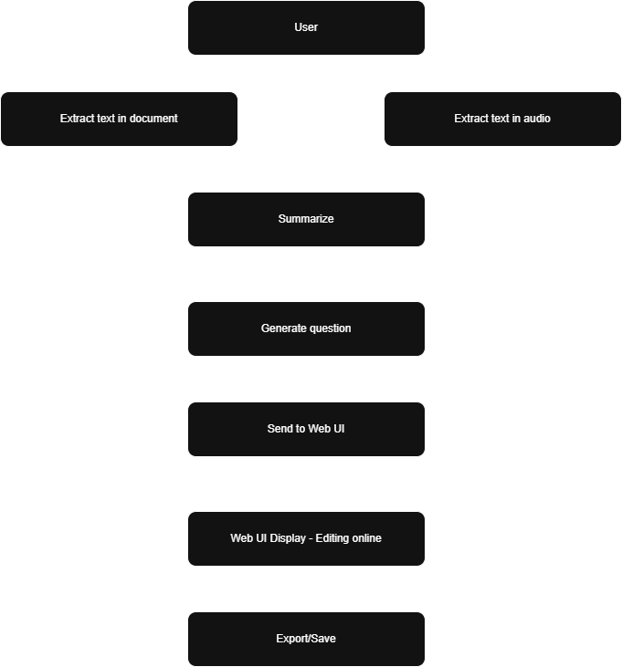

# ⚡ Ultimate MCQs Agent 
[🇺🇸 English](README.md) | [🇻🇳 Tiếng Việt](README.vi.md)

> "Turn your documents into intelligence — automatically summarized and transformed into smart multiple-choice questions."

---

## 🚀 Overview
**Ultimate MCQs Generator** is a FastAPI-powered backend that transforms uploaded documents  
(PDF, DOCX, or TXT) into **summaries and multiple-choice questions (MCQs)** using the power of **Google Gemini**.  

It’s designed for educators, researchers, and developers who want to **automate quiz generation** from any text-based material — fast, smart, and multilingual.

---

## 🧠 Core Features

✅ **Smart Summarization** — automatically summarizes uploaded content.  
✅ **AI-Powered MCQ Generation** — generates clear, structured, and high-quality MCQs.  
✅ **AI Question Evaluation** — automatically evaluates generated question based on accuracy, alignment, distractor quality, and clarity, giving a score from 0–100 and labeling as Accepted, Needs Review, or Rejected.
✅ **Auto Language Detection** — if the document is in English, questions are in English; if Vietnamese, they’re in Vietnamese.  
✅ **File Type Support** — supports `.pdf`, `.docx`, `.txt`, `.mp3`, `wav` and `m4a` files.  
✅ **File Size Protection** — rejects overly large uploads to prevent abuse.  
✅ **CORS Enabled** — easy integration with any frontend or third-party service.  
✅ **JSON-Structured Output** — always returns a clean, parsable JSON array of questions.  

---

## ⚙️ Ultimate MCQs Generator WorkFlow

---

## 🧩 Example Workflow

1️⃣ **User Interaction**
   - The user uploads a file or audio input through the interface.

2️⃣ **Text Extraction**
   - If the input is a document (PDF/DOCX/TXT), the system extracts text using file parsers.
   - If the input is audio, it is transcribed to text using speech-to-text AI.

3️⃣ **Summarization**
   - The extracted text is cleaned and summarized by **Google Gemini**, capturing the essential concepts.

4️⃣ **Question Generation**
   - From the summarized or raw text, Gemini automatically generates high-quality multiple-choice questions (MCQs) with context, options, and correct answers — all returned as structured JSON.

5️⃣ **Web Integration**
   - The generated content is sent to the **Web UI**, where users can preview, edit, and refine questions online in real time.

6️⃣ **Export / Save**
   - Once finalized, the quiz set can be **exported** or **saved** (JSON, CSV, or database), ready for use in e-learning platforms, testing tools, or custom applications.

---

## 🧰 Credits

**Developed by Tran Trong Thuan/Bui Ngoc Son**

**Built with ❤️ using FastAPI + Google Gemini**
> It’s not just an API — it’s a teacher that never sleeps.”
> — Anonymous🧑‍💻

---

## 📜 License

MIT License © 2025 — Tran Trong Thuan/Bui Ngoc Son

Feel free to fork, enhance, and innovate ⚙️
