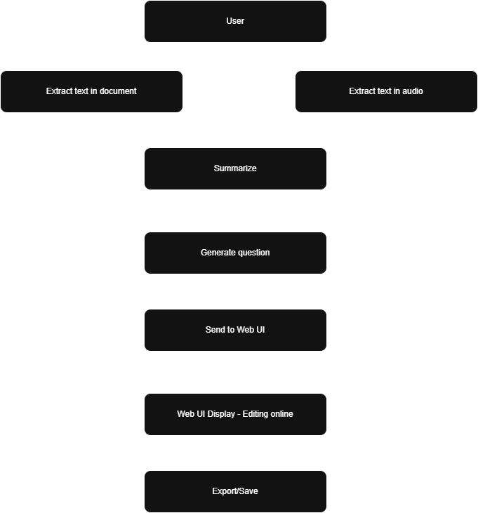

# ⚡ Ultimate MCQs Agent

[🇺🇸 English](README.md) | [🇻🇳 Tiếng Việt](README.vi.md)

> "Biến tài liệu của bạn thành tri thức — được tóm tắt và chuyển đổi tự động thành các câu hỏi trắc nghiệm thông minh."

---

## 🚀 Tổng quan

**Ultimate MCQs Agent** là một hệ thống backend được xây dựng bằng **FastAPI**, có khả năng **chuyển đổi tài liệu tải lên (PDF, DOCX, TXT)** thành **bản tóm tắt và câu hỏi trắc nghiệm (MCQ)** thông qua sức mạnh của **Google Gemini AI**.

Công cụ này được thiết kế dành cho **giảng viên, nhà nghiên cứu, hoặc lập trình viên**, giúp **tự động tạo bộ câu hỏi trắc nghiệm** từ bất kỳ tài liệu nào — **nhanh chóng, thông minh và đa ngôn ngữ**.

---

## 🧠 Tính năng chính

✅ **Tóm tắt thông minh** — tự động rút gọn và tổng hợp nội dung tài liệu.  
✅ **Sinh câu hỏi bằng AI** — tạo ra các câu hỏi rõ ràng, có cấu trúc và độ chính xác cao.  
✅ **Tự động chấm điểm từng câu hỏi theo 4 tiêu chí:** độ chính xác, mức độ phù hợp, chất lượng đáp án nhiễu và độ rõ ràng; trả về điểm tổng (0–100) cùng trạng thái: Chấp nhận / Cần xem lại / Từ chối.  
✅ **Nhận dạng ngôn ngữ tự động** — tự động xác định ngôn ngữ và sinh câu hỏi cùng ngôn ngữ.  
✅ **Hỗ trợ nhiều định dạng** — đọc được tệp `.pdf`, `.docx`, và `.txt`.  
✅ **Giới hạn kích thước tệp** — ngăn người dùng tải lên tệp quá lớn nhằm bảo vệ hệ thống.  
✅ **Tích hợp dễ dàng** — hỗ trợ CORS để kết nối với giao diện web hoặc API khác.  
✅ **Kết quả định dạng JSON chuẩn** — dễ dàng sử dụng cho các hệ thống khác.

---

## ⚙️ Quy trình hoạt động (WorkFlow)

---

## 🧩 Quy trình chi tiết

1️⃣ **Tương tác người dùng**

- Người dùng tải lên **tài liệu (PDF, DOCX, TXT)** hoặc **file âm thanh** thông qua giao diện web.

2️⃣ **Trích xuất văn bản**

- Nếu đầu vào là tài liệu, hệ thống sẽ **trích xuất và làm sạch văn bản** bằng các thư viện chuyên dụng.
- Nếu đầu vào là âm thanh, hệ thống sẽ **chuyển giọng nói thành văn bản** bằng công nghệ **AI nhận dạng giọng nói (Speech-to-Text)**.

3️⃣ **Tóm tắt nội dung**

- Văn bản được **làm sạch và tóm tắt tự động** bằng **Gemini 2.5**, giúp rút gọn và nêu bật các ý chính của tài liệu.

4️⃣ **Sinh câu hỏi trắc nghiệm (MCQ Generation)**

- Dựa trên phần tóm tắt (hoặc nội dung gốc), **Gemini** sẽ tạo ra **các câu hỏi trắc nghiệm chất lượng cao**, bao gồm:
  - **Ngữ cảnh (context)**
  - **Câu hỏi (question)**
  - **Các lựa chọn (options A–D)**
  - **Đáp án chính xác (answer)**
- Toàn bộ được trả về dưới dạng **JSON chuẩn**, dễ dàng xử lý.

5️⃣ **Tích hợp giao diện Web (Web UI)**

- Kết quả được gửi đến **giao diện web**, nơi người dùng có thể **xem, chỉnh sửa và sắp xếp lại câu hỏi** theo ý muốn.

6️⃣ **Xuất / Lưu kết quả**

- Sau khi hoàn thiện, bộ câu hỏi có thể được **xuất ra** hoặc **lưu trữ** dưới dạng `JSON`, `CSV`, hoặc trong **cơ sở dữ liệu**,  
  sẵn sàng tích hợp vào **nền tảng học tập, hệ thống thi trực tuyến, hoặc ứng dụng tùy chỉnh**.

---

## 🧰 Ghi nhận

**Phát triển bởi Tran Trong Thuan/Bui Ngoc Son**

**Xây dựng với ❤️ dùng FastAPI + Google Gemini**

> Đây không chỉ là một API — mà là một người thầy không bao giờ ngủ.”
> — Ẩn danh🧑‍💻

---

## 📜 Giấy phép

Giấy phép MIT © 2025 — Tran Trong Thuan/Bui Ngoc Son

Bạn được tự do sao chép, chỉnh sửa và phát triển dự án này — miễn là giữ lại ghi nhận tác giả và giấy phép gốc ⚙️
